# A.V.I.S. - Analytical Visual Intelligence System

  

**A.V.I.S.** is a next-generation **Automated Exploratory Data Analysis (EDA) & Intelligence Platform** designed to democratize data science. It transforms raw CSV uploads into actionable insights, interactive 3D visualizations, and forensic data quality reports instantly—no coding required.

Built with a **Modern Full-Stack Architecture**, A.V.I.S. bridges the gap between complex data processing and intuitive, beautiful user interfaces.

---

## 🚀 Key Features

### 🔍 1. Forensic Transparency Engine
*   **"Glass Box" Processing**: Unlike black-box tools, A.V.I.S. shows you exactly what happens to your data.
*   **Real-time Audit Logs**: Track every null value filled, row removed, and type inferred with a live console log.
*   **Before vs. After**: Visual diffs of your dataset's health score.

### 📊 2. Automated EDA & Visualization
*   **Instant Stats**: Skewness, Kurtosis, and Distribution analysis in milliseconds.
*   **Draggable Dashboards**: A fully customizable layout engine to arrange your charts.
*   **Smart Charts**: Automatically selects the best visualization (Heatmaps, Scatter, Bar) based on data types.

### 🧠 3. AI-Powered Insights (RAG)
*   **Retrieval Augmented Generation**: Chat with your specific dataset.
*   **Context-Aware**: The AI knows your column names, value ranges, and hidden correlations.
*   **Report Generation**: One-click export of executive summaries in Markdown/PDF.

### ⚡ 4. Performant Architecture
*   **Split Deployment**: Frontend on **Vercel** (Edge), Backend on **Render** (Compute).
*   **Optimized Data Handling**: Handles large datasets with Pandas & NumPy optimization.
*   **Responsive Design**: A mobile-first, glassmorphic UI built with Tailwind CSS.

---

## 🛠️ Technology Stack

Though we follow the principles of the **MERN** data flow (Component-Driven Frontend, RESTful API), we have supercharged the backend with Python for superior data science capabilities.

### **Frontend (The "View")**
*   **Framework**: React 18 (Vite)
*   **Language**: TypeScript (Strict Mode)
*   **Styling**: Tailwind CSS + Custom Animations
*   **Visualize**: Recharts + Lucide Icons
*   **State**: React Hooks + Context API

### **Backend (The "Brain")**
*   **Framework**: FastAPI (Async/Await)
*   **Data Processing**: Pandas, NumPy, Scikit-Learn
*   **Database**: MySQL (SQLModel/SQLAlchemy ORM)
*   **AI Engine**: Groq (Llama 3) / OpenAI Integration
*   **Validation**: Pydantic v2

---

## 📸 Screenshots

### 1. Landing Page (Home)
*The gateway to A.V.I.S. featuring a modern, high-conversion design.*
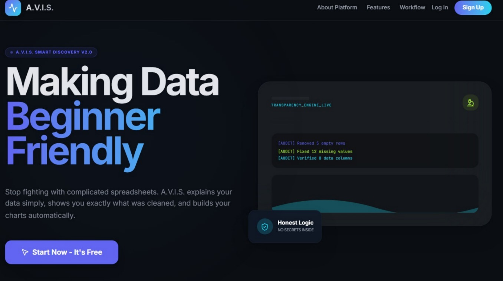

### 2. Secure Authentication
*User-friendly Login & Signup flow.*
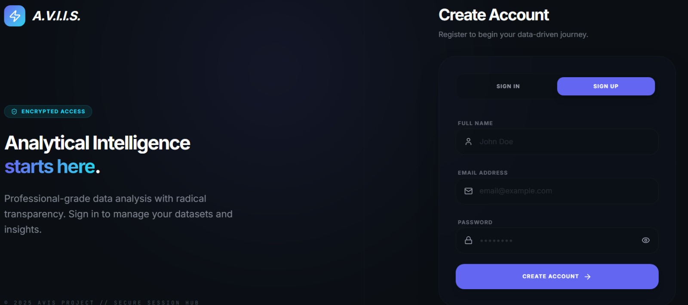

### 3. The Command Center (Dashboard)
*A sleek, dark-mode interface giving you a holistic view of your data projects.*
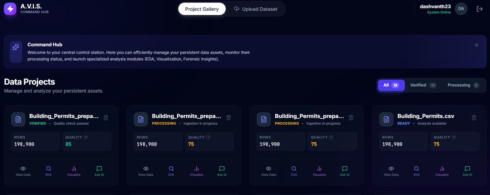

### 4. Data Ingestion & Forensic Console
*Upload datasets and watch the Transparency Engine clean them in real-time.*
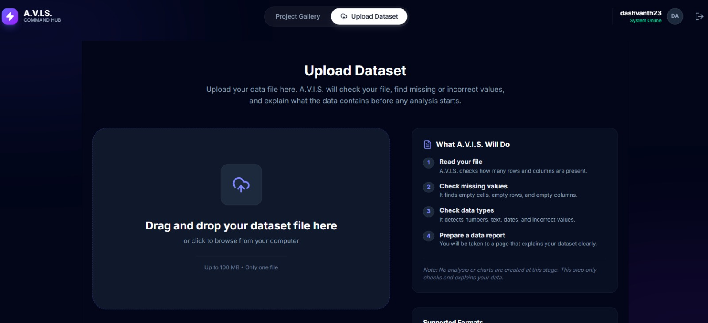
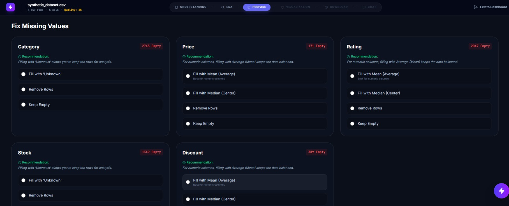

### 5. Automated EDA
*Instant statistical analysis, distribution checks, and correlation matrices.*
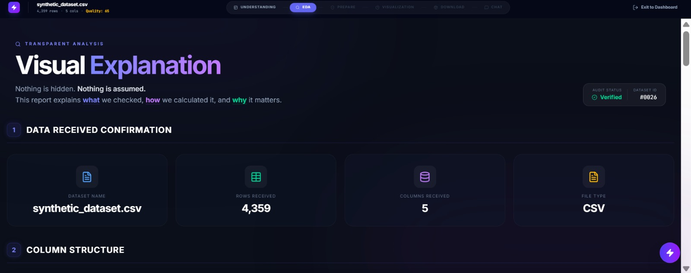
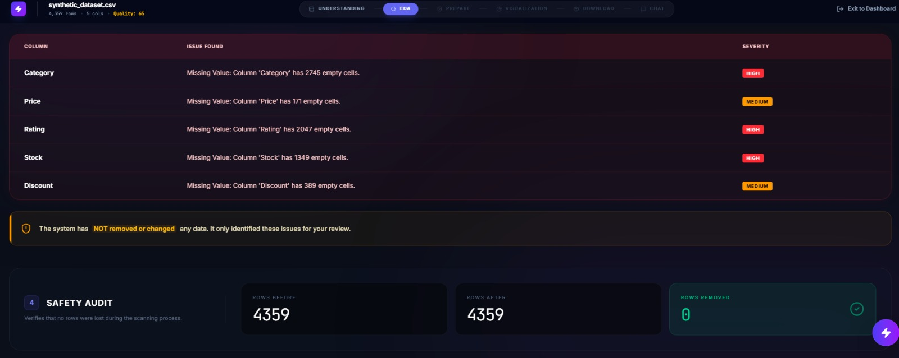

### 6. Interactive Visualizations
*Dynamic 3D charts and heatmaps that respond to your data filters.*
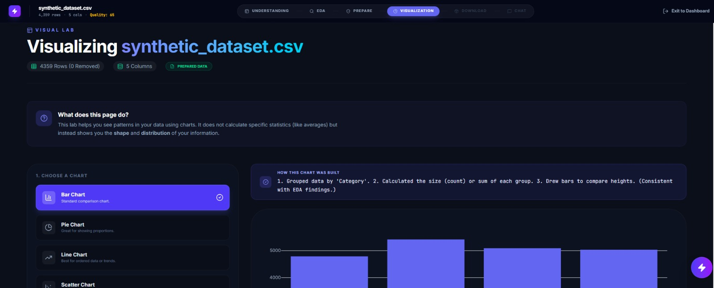
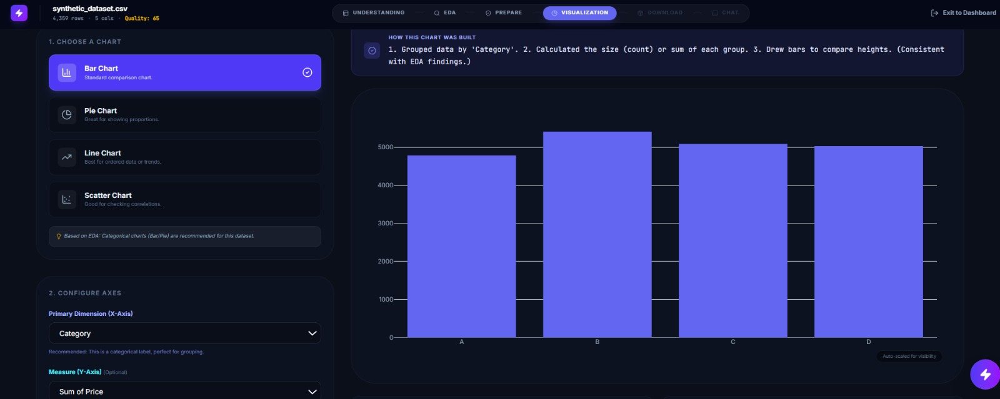

### 7. AI Assistant & Insights
*Context-aware chat helping you understand your data patterns.*
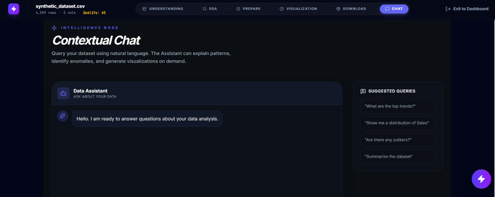

### 8. Export Center
*Download cleaned datasets and generated reports.*
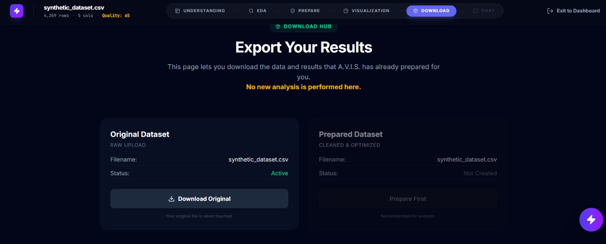

---

## 🏗️ Installation & Setup

### Prerequisites
*   Node.js (v18+)
*   Python (v3.9+)
*   MySQL Server (Optional, defaults to SQLite for dev)

### 1. Clone the Repository
```bash
git clone https://github.com/dashvanth/AVIS.git
cd AVIS/avis
```

### 2. Backend Setup
```bash
cd backend
python -m venv venv
# Windows:
venv\Scripts\activate
# Mac/Linux:
source venv/bin/activate

pip install -r requirements.txt
```

**Environment Variables** (`backend/.env`):
```env
DATABASE_URL=sqlite:///./avis.db
GROQ_API_KEY=your_key_here
SECRET_KEY=your_secret
```

Start the Server:
```bash
uvicorn main:app --reload
```

### 3. Frontend Setup
Open a new terminal:
```bash
cd frontend
npm install
npm run dev
```

Visit `http://localhost:5173` to launch A.V.I.S!

---

## ☁️ Deployment

We use a **Split Strategy** for maximum performance:

| Component | Host | Reason |
| :--- | :--- | :--- |
| **Frontend** | **Vercel** | Fast Edge CDN for static assets & React SPA. |
| **Backend** | **Render** | Dedicated Python compute environment for heavy ML libraries. |

---

## 🤝 Contributing

We welcome contributions! Please see `CONTRIBUTING.md` for details on our code of conduct and development process.

1.  Fork the Project
2.  Create your Feature Branch (`git checkout -b feature/AmazingFeature`)
3.  Commit your Changes (`git commit -m 'Add some AmazingFeature'`)
4.  Push to the Branch (`git push origin feature/AmazingFeature`)
5.  Open a Pull Request

---

**Designed & Developed by Dashvanth**
*2025 A.V.I.S. Project*
